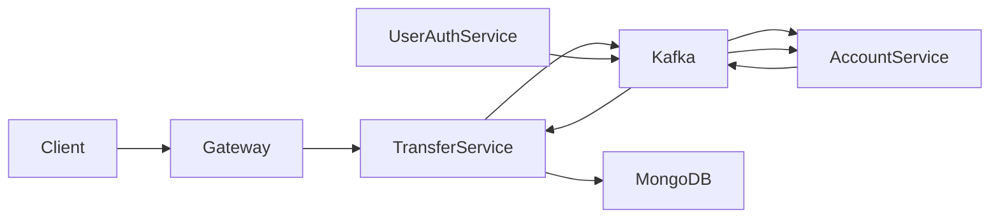
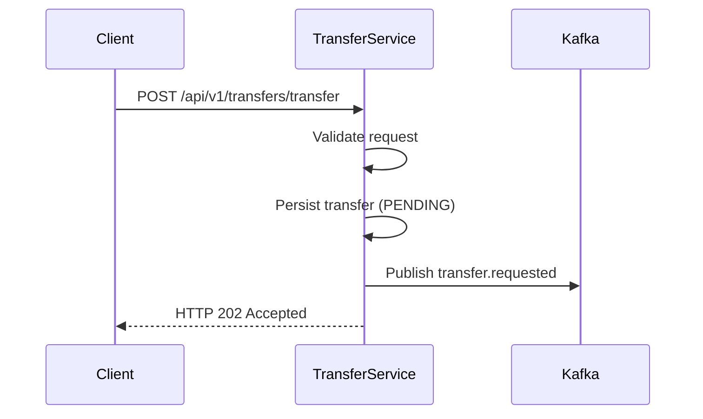
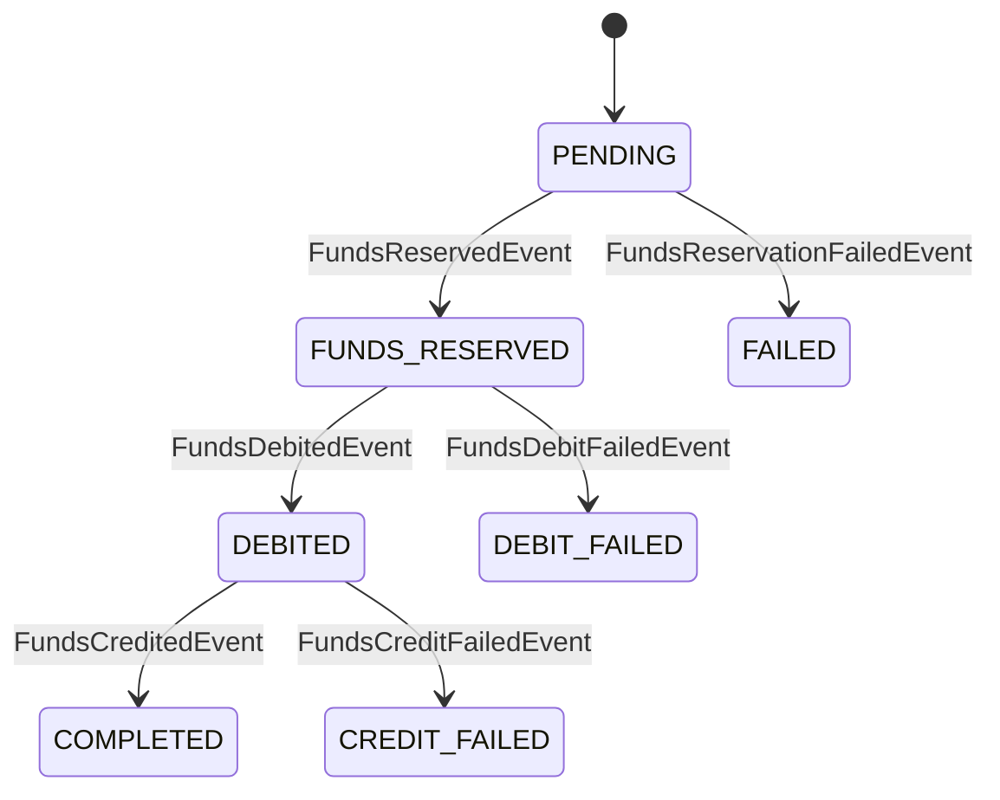
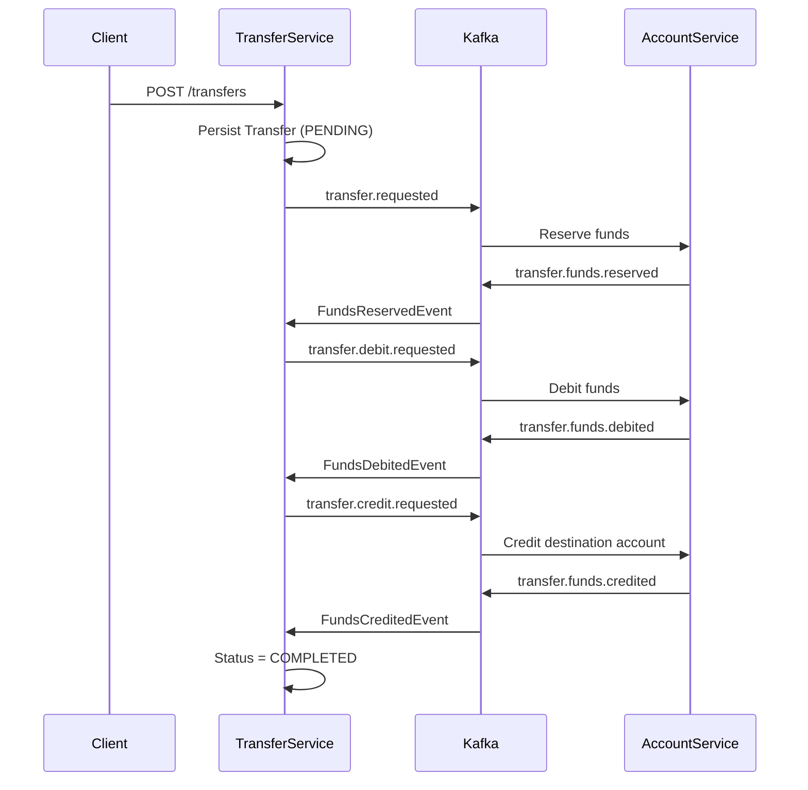
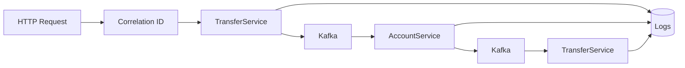

# Transfer Service

## Objetivo

Transfer Service es el microservicio responsable de coordinar las transferencias económicas entre cuentas dentro de la plataforma.

A diferencia del resto de servicios, su responsabilidad no consiste en almacenar información de usuarios ni administrar balances bancarios, sino en **orquestar operaciones distribuidas** que involucran varios microservicios y garantizar que cada transferencia alcance un estado consistente.

Cada solicitud de transferencia inicia un proceso compuesto por múltiples pasos independientes que deben ejecutarse en un orden determinado. Como cada paso se realiza en servicios distintos y sobre bases de datos diferentes, no es posible utilizar transacciones distribuidas tradicionales.

Para resolver este problema, la plataforma implementa una **Saga basada en eventos**, donde Transfer Service actúa como coordinador del flujo completo, reaccionando a los eventos publicados por el resto de microservicios y decidiendo cuál debe ser el siguiente paso de la operación.

---

## Responsabilidades

Transfer Service concentra toda la lógica de coordinación de una transferencia.

Entre sus principales responsabilidades se encuentran:

- Recibir las solicitudes de transferencia desde la API REST.
- Crear el registro inicial de la operación.
- Generar un identificador único de transacción.
- Iniciar la Saga publicando el primer evento.
- Coordinar cada fase del proceso mediante eventos Kafka.
- Actualizar el estado de la transferencia durante todo su ciclo de vida.
- Gestionar errores y activar compensaciones cuando una operación no puede completarse.
- Registrar métricas de negocio para monitorizar el comportamiento del sistema.

Este servicio **no modifica directamente los balances bancarios**.

Las operaciones financieras son responsabilidad exclusiva de Account Service.

Transfer Service únicamente coordina el flujo distribuido y mantiene el estado global de cada operación.

---

## Arquitectura

Transfer Service implementa el patrón **Saga Orchestrator**.

En este modelo existe un único componente responsable de decidir cuál es el siguiente paso de una transacción distribuida.

En lugar de que cada microservicio conozca el flujo completo de la operación, cada servicio únicamente ejecuta su responsabilidad y publica el resultado mediante eventos.

Transfer Service escucha dichos eventos y decide qué acción debe realizarse a continuación.

Esta aproximación ofrece varias ventajas:

- Bajo acoplamiento entre microservicios.
- Escalabilidad horizontal.
- Independencia tecnológica.
- Mayor resiliencia ante fallos.
- Posibilidad de incorporar nuevos participantes sin modificar el resto de servicios.

---

## Papel dentro de la plataforma

La siguiente figura resume la posición de Transfer Service dentro de la arquitectura.

Transfer Service actúa como punto de coordinación entre los distintos componentes de la plataforma.

No ejecuta operaciones financieras directamente, sino que transforma una petición HTTP en un flujo distribuido de eventos que termina cuando la transferencia alcanza un estado final (**COMPLETED** o **FAILED**).

---

## Ciclo de vida de una solicitud

El procesamiento comienza cuando un cliente solicita una transferencia mediante la API REST.

En ese momento el servicio:

1. Valida la solicitud.
2. Genera un identificador único (`transactionId`).
3. Persiste la transferencia con estado **PENDING**.
4. Publica el evento `transfer.requested`.
5. Devuelve inmediatamente un **HTTP 202 Accepted**.

A partir de ese instante, toda la operación continúa de forma completamente asíncrona mediante Kafka.

La respuesta HTTP únicamente confirma que la solicitud ha sido aceptada para su procesamiento, no que la transferencia haya finalizado correctamente.

Este diseño evita mantener conexiones abiertas durante operaciones largas y desacopla completamente al cliente del procesamiento interno de la plataforma.

---

## API REST

Actualmente Transfer Service expone un único endpoint público.

| Método | Endpoint | Descripción |
|---------|----------|-------------|
| POST | `/api/v1/transfers/transfer` | Inicia una nueva transferencia distribuida |

La API únicamente inicia el proceso.

Toda la lógica de negocio continúa posteriormente mediante comunicación asíncrona basada en eventos.

---

---

# Modelo de persistencia

Transfer Service mantiene el estado de cada transferencia mediante la entidad `TransferDocument`, almacenada en MongoDB.

A diferencia de `AccountService`, cuyo objetivo es garantizar la consistencia financiera de las cuentas, este servicio persiste exclusivamente el ciclo de vida de una operación distribuida.

Cada documento representa una transferencia completa desde su creación hasta su finalización o compensación.

La información almacenada incluye:

- Usuario origen.
- Usuario destino.
- Importe y moneda.
- Tipo de transferencia.
- Estado actual.
- Motivo del fallo, cuando existe.
- Fecha de creación.
- Fecha de última actualización.
- Identificador único de transacción (`transactionId`).

Este modelo permite reconstruir el recorrido completo de cualquier operación y conocer en qué punto de la Saga se encuentra una transferencia en cada momento.

---

## ¿Por qué MongoDB?

Transfer Service no administra información relacional ni requiere operaciones complejas entre múltiples entidades.

Su responsabilidad consiste en mantener el estado de un proceso distribuido que evoluciona mediante transiciones claramente definidas.

MongoDB resulta especialmente adecuado para este escenario porque permite almacenar cada transferencia como un único documento autocontenido, facilitando la evolución del modelo y reduciendo la complejidad de acceso a los datos.

Las consultas más habituales se realizan sobre:

- `transactionId`
- `status`
- `sourceUserId`
- `destinationUserId`

Todos estos campos se encuentran indexados para optimizar las búsquedas durante la ejecución de la Saga y las tareas de monitorización.

---

# Gestión del estado de una transferencia

Una transferencia no se completa mediante una única operación.

Durante su ejecución atraviesa distintos estados que reflejan el progreso de la Saga.

Cada cambio de estado únicamente se produce cuando el servicio recibe el evento correspondiente desde Kafka.

De esta forma, el estado almacenado representa siempre la situación real de la operación distribuida.

| Estado | Descripción |
|----------|-------------|
| **PENDING** | La transferencia ha sido creada y espera iniciar el proceso de reserva de fondos. |
| **FUNDS_RESERVED** | Los fondos han sido bloqueados correctamente en la cuenta origen. |
| **DEBITED** | El importe ha sido descontado definitivamente de la cuenta origen. |
| **COMPLETED** | La transferencia ha finalizado correctamente. |
| **FAILED** | La operación no ha podido completarse y finaliza con error. |

---

## Máquina de estados

Cada transferencia evoluciona siguiendo una secuencia de estados bien definida.

Esta máquina de estados constituye el núcleo del comportamiento de Transfer Service.

Cada transición está provocada por un evento recibido desde `AccountService`, evitando dependencias directas entre ambos servicios y permitiendo que la operación continúe incluso cuando existen retrasos en la comunicación.

---

# Coordinación de la Saga

Transfer Service implementa el patrón **Saga Orchestrator**.

Su responsabilidad consiste en decidir cuál es el siguiente paso de una transferencia distribuida en función del resultado obtenido en la fase anterior.

En ningún momento ejecuta operaciones financieras directamente.

Cada modificación del saldo es responsabilidad exclusiva de `AccountService`.

Transfer Service únicamente:

- mantiene el estado global de la operación;
- publica el siguiente evento de la Saga;
- procesa los eventos recibidos;
- decide cuándo una transferencia debe finalizar;
- activa las compensaciones cuando es necesario.

Este diseño reduce el acoplamiento entre servicios y permite que cada microservicio permanezca especializado en una única responsabilidad.

---

## Flujo principal de una transferencia

El siguiente diagrama resume el recorrido habitual de una transferencia completada correctamente.

La respuesta HTTP enviada al cliente únicamente confirma que la transferencia ha sido aceptada para su procesamiento.

El resultado final de la operación se obtiene posteriormente mediante el intercambio de eventos entre los distintos microservicios.

Esta aproximación elimina el acoplamiento temporal entre cliente y servidor, mejora la escalabilidad del sistema y permite procesar operaciones distribuidas de larga duración sin mantener conexiones HTTP abiertas.

---

---

# Comunicación basada en eventos

Transfer Service coordina la ejecución de la Saga mediante comunicación asíncrona basada en Apache Kafka.

En lugar de invocar directamente a otros microservicios mediante llamadas síncronas, cada fase de la operación se representa mediante un evento publicado en un tópico específico.

Este enfoque permite desacoplar completamente los participantes de la transacción, mejorar la resiliencia del sistema y facilitar la recuperación ante fallos temporales.

Transfer Service actúa simultáneamente como **productor** y **consumidor** de eventos.

---

## Eventos publicados

Durante el ciclo de vida de una transferencia, el servicio publica los siguientes eventos.

| Evento | Descripción |
|----------|-------------|
| `transfer.requested` | Inicia la reserva de fondos en la cuenta origen. |
| `transfer.debit.requested` | Solicita el débito definitivo del importe reservado. |
| `transfer.credit.requested` | Solicita el abono del importe en la cuenta destino. |

Cada uno de estos eventos representa una nueva fase de la Saga.

Transfer Service únicamente publica el siguiente evento cuando el paso anterior ha finalizado correctamente.

---

## Eventos consumidos

El servicio escucha los eventos publicados por `AccountService` para conocer el resultado de cada operación financiera.

| Evento recibido | Acción realizada |
|-----------------|------------------|
| `transfer.funds.reserved` | Actualiza el estado y solicita el débito definitivo. |
| `transfer.funds.reservation.failed` | Finaliza la transferencia como `FAILED`. |
| `transfer.funds.debited` | Actualiza el estado y solicita el crédito en destino. |
| `transfer.funds.debit.failed` | Finaliza la transferencia como `DEBIT_FAILED`. |
| `transfer.funds.credited` | Marca la transferencia como `COMPLETED`. |
| `transfer.funds.credit.failed` | Inicia la compensación y finaliza la transferencia como `CREDIT_FAILED`. |

Este modelo convierte a Transfer Service en un **orquestador dirigido por eventos**, donde cada transición de estado depende exclusivamente del evento recibido desde el resto de la plataforma.

---

# Gestión de compensaciones

En sistemas distribuidos no es posible garantizar la atomicidad mediante una única transacción que abarque varios microservicios.

Para resolver este problema, la plataforma implementa el patrón **Saga**, donde cada operación dispone de su correspondiente acción compensatoria.

Cuando una fase falla, Transfer Service decide automáticamente cómo debe recuperarse el sistema.

Las compensaciones implementadas actualmente son:

| Punto de fallo | Acción compensatoria |
|----------------|----------------------|
| Error durante la reserva de fondos | La transferencia finaliza como `FAILED`. No existen cambios que revertir. |
| Error durante el débito | Se liberan los fondos previamente reservados y la transferencia finaliza como `DEBIT_FAILED`. |
| Error durante el crédito | Se devuelve el importe a la cuenta origen y la transferencia finaliza como `CREDIT_FAILED`. |

Gracias a este mecanismo, la plataforma evita situaciones inconsistentes como:

- fondos reservados indefinidamente;
- dinero descontado sin llegar al destinatario;
- operaciones parcialmente ejecutadas.

Cada posible punto de fallo dispone de una estrategia de recuperación específica, garantizando que el sistema siempre alcance un estado consistente.

---

## Recuperación ante errores

Además de las compensaciones funcionales, la plataforma incorpora mecanismos adicionales para aumentar la resiliencia frente a errores temporales.

Entre ellos destacan:

- reintentos automáticos durante el procesamiento de eventos;
- Dead Letter Topics (DLT) para eventos que no pueden procesarse correctamente;
- trazabilidad completa mediante `Correlation ID`;
- persistencia del estado de cada transferencia.

Esta combinación permite recuperar operaciones interrumpidas sin perder el contexto de ejecución ni comprometer la consistencia del sistema.

---

# Observabilidad

Transfer Service constituye el punto central desde el que se monitoriza el comportamiento funcional de la plataforma.

Además de exponer las métricas técnicas habituales mediante Spring Boot Actuator y Micrometer, el servicio registra métricas de negocio que permiten conocer el estado real del sistema en tiempo de ejecución.

Entre las métricas implementadas destacan:

| Métrica | Descripción |
|----------|-------------|
| `business.transfer.created` | Número total de transferencias iniciadas. |
| `business.transfer.completed` | Número total de transferencias completadas correctamente. |
| `business.transfer.failed` | Número total de transferencias fallidas. |
| `business.transfer.processing.time` | Tiempo necesario para completar una transferencia. |
| `business.transfer.pending` | Transferencias actualmente pendientes de procesamiento. |
| `business.transfer.in_progress` | Transferencias que se encuentran ejecutándose. |

Estas métricas permiten construir paneles de monitorización en Grafana y detectar fácilmente situaciones anómalas, cuellos de botella o incrementos inesperados en el número de operaciones fallidas.

---

## Trazabilidad distribuida

Cada transferencia genera un **Correlation ID** que acompaña a todos los eventos publicados durante la ejecución de la Saga.

Este identificador se propaga mediante las cabeceras de Kafka y se incorpora automáticamente a los logs de todos los microservicios.

De esta forma es posible reconstruir el recorrido completo de una operación distribuida consultando únicamente el identificador de correlación, simplificando significativamente las tareas de monitorización y diagnóstico.

---

# Conclusión

Transfer Service constituye el núcleo funcional de la plataforma.

Mientras que otros microservicios se centran en responsabilidades concretas, este servicio coordina operaciones distribuidas entre distintos participantes, manteniendo el estado global de cada transferencia y garantizando la consistencia del sistema mediante una implementación basada en eventos.

La combinación del patrón Saga, la comunicación asíncrona mediante Kafka, la persistencia del estado de las operaciones, las compensaciones automáticas, la propagación del `Correlation ID` y las métricas de negocio convierten a este microservicio en el elemento central de la arquitectura distribuida desarrollada en este proyecto.

Más allá de implementar una funcionalidad bancaria, Transfer Service demuestra cómo abordar problemas habituales en sistemas distribuidos modernos mediante patrones de diseño ampliamente utilizados en entornos profesionales.

## Documentación general

| Documento | Descripción |
|-----------|-------------|
| [README.md](README.md) | Visión general de la plataforma. |
| [ARCHITECTURE.md](ARCHITECTURE.md) | Arquitectura, principios de diseño y decisiones técnicas. |
| [EVENTS.md](EVENTS.md) | Comunicación mediante eventos, Kafka y patrón Saga. |
| [SECURITY.md](SECURITY.md) | Autenticación, autorización y seguridad con JWT. |

## Microservicios

| Servicio | Documentación |
|----------|---------------|
| API Gateway | [APIGATEWAY](APIGATEWAY.md) |
| User Authentication Service | [USERAUTHSERVICE](USERAUTHSERVICE.md) |
| Account Service | [ACCOUNTSERVICE](ACCOUNTSERVICE.md) |
| Transfer Service | [TRANSFERSERVICE](TRANSFERSERVICE.md) |
| Infrastructure | [INFRASTRUCTURE](INFRASTRUCTURE.md) |